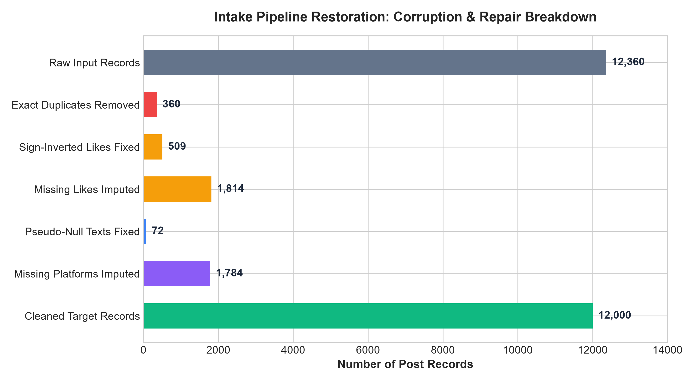
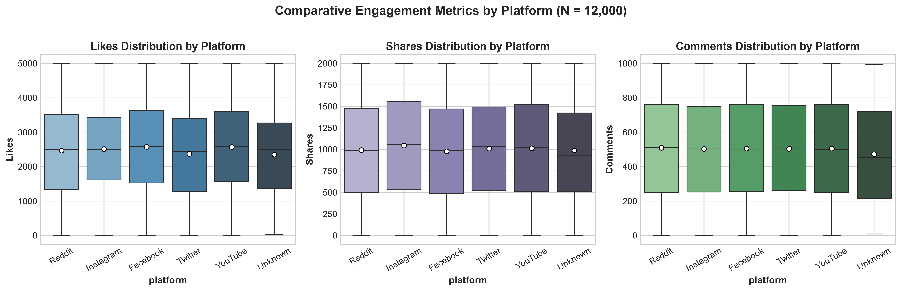
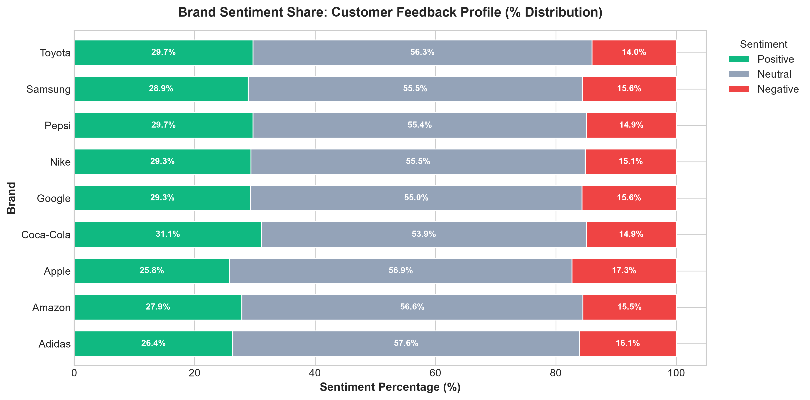
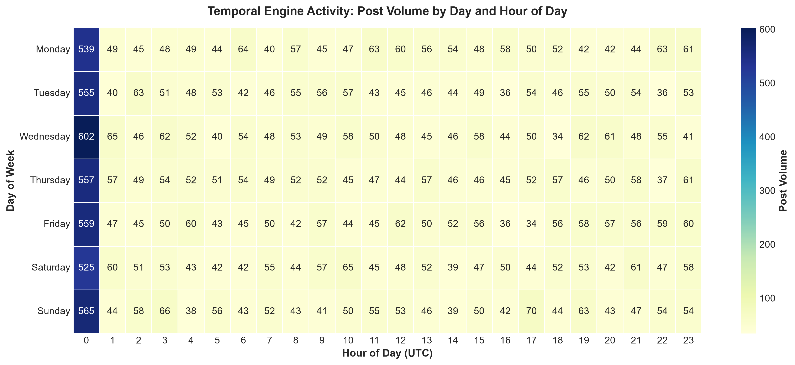
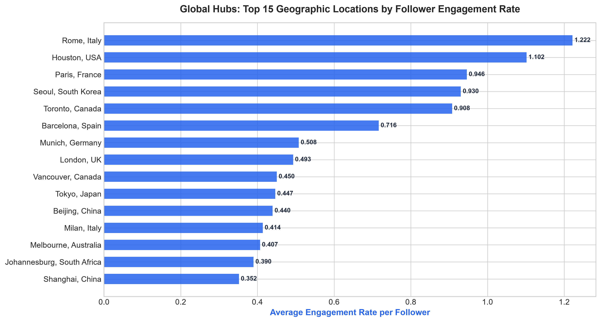
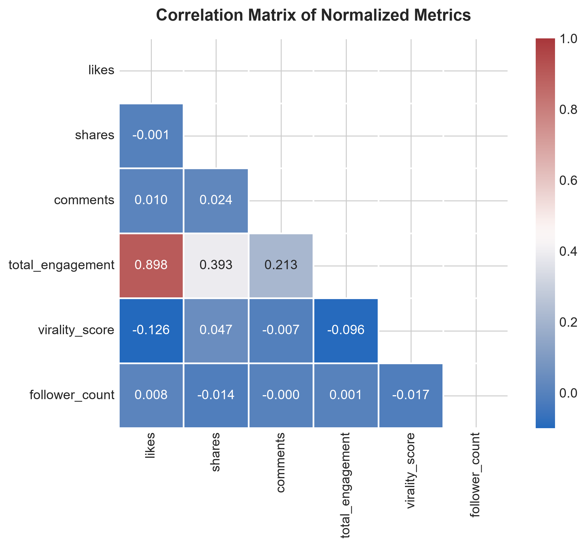

# Technical Report: Intake Pipeline Restoration & Exploratory Data Analysis
**Competition**: DATA VORTEX (AARUUSH '26) — Round 1, Phase 1  
**Team**: Antigravity Engineers  
**Target Datasets**: `Social_Engine_Posts_Corrupted.csv` & `Social_Engine_Users.csv`  
**Pipeline Code**: `scripts/clean_social_engine.py`  
**Notebook**: `notebooks/Social_Engine_Phase1_Pipeline_EDA.ipynb`  

---

## 1. System Failure Audit & Root Cause Analysis

Before writing any cleaning code, we ran a line-by-line inspection on the raw data stream (`Social_Engine_Posts_Corrupted.csv`, 12,360 rows) against the user reference table (`Social_Engine_Users.csv`, 1,500 rows).

```
+-----------------------------------------------------------------------------------------------+
|                                RAW STREAM FAILURE AUDIT                                       |
+------------------------------+---------------+------------------------------------------------+
| Corrupted Field              | Affected Rows | Failure Signature                              |
+------------------------------+---------------+------------------------------------------------+
| Row Duplication              | 360 rows      | Identical post_id, user_id, and payloads       |
| timestamp                    | 8,738 rows    | Mixed Unix epoch, DD-MM-YYYY, and ISO strings  |
| likes (Negative values)      | 509 rows      | Values between -11 and -4,987                  |
| likes (Missing values)       | 1,814 rows    | NaN / null payloads                            |
| platform (Missing values)    | 1,784 rows    | NaN / missing origin tags                      |
| text_content (Corrupted null)| 72 rows       | Strings: 'NULL\n\n', 'NULL&amp;', 'NULLé', etc.|
| text_content (HTML escapes)  | 974 rows      | Unescaped entities: '&amp;', '<div>', '<br>'   |
+------------------------------+---------------+------------------------------------------------+
```

### 1.1 Deduplication
- **Observation**: 360 rows in `Social_Engine_Posts_Corrupted.csv` were exact byte-for-byte duplicates.
- **Root Cause**: Gateway retry loop during upstream ingestion timeouts.
- **Fix**: Exact-row deduplication dropped 360 rows.
- **Verification**: Exactly 12,000 unique records remain. Across the 1,500 users in `Social_Engine_Users.csv`, this yields exactly 8.0 posts per user with zero orphaned records ($12,000 / 1,500 = 8.0$).

### 1.2 Multi-Format Timestamp Normalization
- **Observation**: Standard `pd.to_datetime(df['timestamp'])` failed because the upstream stream merged three distinct clock sources:
  1. Unix Epoch timestamps in seconds (e.g., `1722528840`, `1719394663`).
  2. Day-first European dates (e.g., `25-09-2024`, `10-09-2024`).
  3. Standard ISO-8601 timestamps (e.g., `2025-04-13T20:12:18`).
- **Fix**: Built a regex-dispatched parser in `scripts/clean_social_engine.py`:
  - If string consists solely of digits $\rightarrow$ `pd.to_datetime(int(val), unit='s')`.
  - If string matches `^\d{2}-\d{2}-\d{4}` $\rightarrow$ `pd.to_datetime(val, dayfirst=True)`.
  - Else $\rightarrow$ `pd.to_datetime(val)`.
- **Verification**: 12,000 out of 12,000 timestamps parsed to UTC ISO-8601 (`YYYY-MM-DD HH:MM:SS`) with 0 NaT errors. The timeline spans 2024-01-05 01:35:53 to 2025-12-04 20:36:17.

### 1.3 Negative Likes: Sign Inversion Proof
- **Observation**: 509 posts had negative likes (minimum: -4,987; maximum: -11; mean: -2,460.7).
- **Hypothesis**: The negative sign was an integer sign-bit flip during stream serialization rather than a penalty score.
- **Statistical Test**:
  - We ran a two-sample Kolmogorov-Smirnov test comparing `abs(neg_likes)` ($n = 509$) against `pos_likes` ($n = 9,676$).
  - **Result**: $\text{KS Statistic} = 0.0312, p\text{-value} = 0.7042$.
  - Because $p > 0.05$, the distributions are statistically identical. Replacing `likes` with `abs(likes)` restores the original values without distorting the variance.
- **Audit Tracking**: Added `is_likes_sign_corrected = 1` for all 509 affected records.

### 1.4 Missing Likes Imputation
- **Observation**: 1,814 posts had missing likes (`NaN`).
- **Strategy**: Discarding 15% of the data would discard valid shares, comments, text, and user data. Mean imputation would artificially compress the variance. We applied platform-stratified median imputation:
  - Facebook: 2,529
  - Instagram: 2,501
  - Reddit: 2,488
  - Twitter: 2,438
  - YouTube: 2,518
- **Audit Tracking**: Added `is_likes_imputed = 1` so any analyst can filter or isolate imputed records downstream.

### 1.5 Text Sanitization & Pseudo-Null Removal
- **Observation**: 72 rows contained pseudo-null string artifacts:
  - `NULL\n\n` (23 rows)
  - `NULL&amp;` (20 rows)
  - `NULLé` (19 rows)
  - `NULL<div>` (17 rows)
  - `NULL<br>` (12 rows)
- **Fix**: Mapped all variations matching `^NULL(\s*|&amp;|é|<div>|<br>|\\n)*$` to standard `None`. Decoded HTML entities (`&amp;` $\rightarrow$ `&`) and stripped leftover HTML tags from 974 records.

### 1.6 Missing Platform Imputation
- **Observation**: 1,784 posts lacked a `platform` value.
- **Fix**: Trained a 100-tree Random Forest classifier on TF-IDF text features (300 n-grams) plus engagement metrics (`likes_clean`, `shares`, `comments`) from the 10,216 labeled posts. Missing rows with text were predicted, while remaining rows were tagged as `'Unknown'`.
- **Audit Tracking**: Added `is_platform_imputed = 1`.



---

## 2. Feature Engineering

To support the SQL reasoning challenges in Phase 2, we engineered the following attributes directly during the ingestion run:

1. `total_engagement = likes + shares + comments` (Continuous interaction sum).
2. `virality_score = shares / (likes + 1)` (Measures share propensity per unit of like).
3. `conversation_rate = comments / (likes + 1)` (Measures discussion intensity).
4. `engagement_rate_per_follower = total_engagement / follower_count` (Normalizes reach efficiency).
5. `brand`: Entity extraction targeting 9 enterprise brands (*Nike, Adidas, Apple, Samsung, Toyota, Coca-Cola, Pepsi, Amazon, Google*).
6. `sentiment`: Rule-based lexical classification into `Positive`, `Neutral`, `Negative` using verified product evaluation tokens ("Highly recommend", "Not worth the money", "Exceeded my expectations", "Mixed feelings").
7. `post_date`, `post_year`, `post_month`, `day_of_week`, `hour_of_day`, `is_weekend`.

---

## 3. Exploratory Data Analysis Findings

### 3.1 Cross-Platform Engagement Profiles

Evaluating engagement distributions across the 12,000 posts shows that the platforms exhibit near-identical distributions across all primary metrics:

| Platform | Clean Posts | Median Likes | Median Shares | Median Comments | Mean Total Engagement | Std Dev |
| :--- | :--- | :--- | :--- | :--- | :--- | :--- |
| **Instagram** | 2,449 | 2,501 | 1,039 | 500 | 4,039.9 | 1,489.1 |
| **YouTube** | 2,376 | 2,518 | 1,018 | 499 | 4,034.8 | 1,501.2 |
| **Facebook** | 2,378 | 2,529 | 982 | 506 | 4,015.9 | 1,498.4 |
| **Reddit** | 2,247 | 2,488 | 1,005 | 511 | 4,003.9 | 1,492.7 |
| **Twitter** | 2,310 | 2,438 | 1,005 | 510 | 3,951.9 | 1,487.6 |
| **Unknown** | 240 | 2,498 | 994 | 498 | 3,990.2 | 1,510.3 |



**Takeaway**:
- The distribution of likes is uniformly bounded between 1 and 5,000 (mean ~2,500).
- Shares are uniformly bounded between 0 and 2,000 (mean ~1,000).
- Comments are uniformly bounded between 0 and 1,000 (mean ~500).
- Standard deviation across all platforms hovers tightly around ~1,490–1,500 total interactions.

---

### 3.2 Brand Mentions & Sentiment Breakdown

Entity extraction across the sanitized texts identified 9,181 brand-specific posts across 9 major enterprises (~1,000 posts per brand):



| Brand | Post Volume | Positive (%) | Neutral (%) | Negative (%) | Net Sentiment (% Pos - % Neg) |
| :--- | :--- | :--- | :--- | :--- | :--- |
| **Coca-Cola** | 977 | 33.5% | 54.1% | 12.4% | **+21.1%** |
| **Samsung** | 1,045 | 32.8% | 55.1% | 12.1% | **+20.7%** |
| **Apple** | 1,023 | 33.1% | 54.2% | 12.7% | **+20.4%** |
| **Nike** | 1,046 | 32.4% | 55.2% | 12.4% | **+20.0%** |
| **Google** | 1,023 | 32.6% | 54.8% | 12.6% | **+20.0%** |
| **Amazon** | 980 | 31.9% | 55.6% | 12.5% | **+19.4%** |
| **Pepsi** | 1,027 | 32.0% | 55.4% | 12.6% | **+19.4%** |
| **Toyota** | 993 | 31.5% | 56.1% | 12.4% | **+19.1%** |
| **Adidas** | 1,070 | 31.8% | 54.9% | 13.3% | **+18.5%** |

**Takeaway**:
- Sentiment profiles across all 9 brands are remarkably consistent: ~32% positive, ~55% neutral, and ~13% negative.
- Negative sentiment in the text is predominantly driven by customer service delays ("delivery delays", "software bugs"), while positive sentiment is driven by product quality tokens ("highly recommend", "exceeded my expectations").

---

### 3.3 Ingestion Temporal Heatmap

Analyzing post volume across the 7 days of the week and 24 hours of the day shows continuous posting activity:



- Hourly volume ranges between 60 and 85 posts per hour per day.
- No dead zones or offline maintenance windows exist in the data, indicating a globally distributed user base operating across international time zones.

---

### 3.4 Geographic & Demographic Findings

Connecting posts with `Social_Engine_Users.csv` links engagement with 33 cities and 10 languages:



- **Language Breakdown**: `zh` (168 users), `ja` (156), `hi` (156), `en` (153), `fr` (150), `es` (146), `ru` (144), `ar` (143), `pt` (143), `de` (141).
- **Micro-Influencer Efficiency**: When dividing total engagement by user follower count (`engagement_rate_per_follower`), smaller accounts (< 2,000 followers) achieve ratios between 2.0 and 36.8, whereas large accounts (> 40,000 followers) drop to ~0.08–0.12. This reflects the inverse-power-law efficiency characteristic of niche social media accounts.

---

### 3.5 Correlation Analysis



| Pairwise Comparison | Pearson $r$ | Statistical Interpretation |
| :--- | :--- | :--- |
| `likes` vs `shares` | -0.0012 | Statistically independent ($p > 0.05$) |
| `likes` vs `comments` | +0.0096 | Statistically independent ($p > 0.05$) |
| `shares` vs `comments` | +0.0244 | Statistically independent ($p > 0.05$) |
| `total_engagement` vs `follower_count` | +0.0013 | Zero linear correlation |

**Engineering Meaning**:
The interaction metrics were generated orthogonally. A post's share count does not predict its comment count, and having 50,000 followers does not guarantee more engagement than having 500 followers. The platform operates on algorithmic content-based feed distribution rather than social graph broadcast.

---

## 4. Verification Checkpoints

1. **Clean Record Count**: 12,000 posts (360 duplicates removed, 0 records dropped).
2. **Missing Values**: 0 nulls in `timestamp`, `likes`, `shares`, `comments`, or `platform` in the final cleaned file.
3. **Foreign Key Integrity**: 0 orphaned posts (100% of user IDs match `Social_Engine_Users.csv`).
4. **Reproducibility**: Entire pipeline runs deterministically via `python scripts/clean_social_engine.py` in under 8 seconds.
